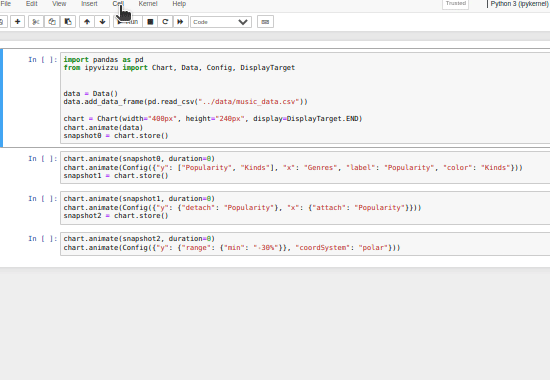

# Chart settings

You can change the behaviour of the chart with the constructor arguments and the
chart properties detailed below.

## Constructor arguments

### Chart size

The size of the chart can be changed with `width` and `height`
[constructor](../reference/ipyvizzu/chart.md#ipyvizzu.chart.Chart.__init__)
arguments.

!!! info
    `width` and `height` constructor arguments are optional, the default values
    are `800px` and `480px`. You can set them to any valid cssText value.

```python
from ipyvizzu import Chart


chart = Chart(width="100%", height="500px")
```

### Display behavior

There are multiple options for the logic of where and how the chart is displayed
within the notebook and this behavior can be changed with the `display`
[constructor](../reference/ipyvizzu/chart.md#ipyvizzu.chart.Chart.__init__)
argument.

!!! info
    `display` constructor argument is optional, the default value is
    [DisplayTarget.ACTUAL](../reference/ipyvizzu/template.md#ipyvizzu.template.DisplayTarget).

!!! note
    Not all options work in all environments, check the
    [Environments chapter](../environments/index.md) for more details.

#### Actual

{ class='image-center' }

Chart is relocated and displayed after each cell that has been run. This is set
by default or if `display` is set to `DisplayTarget.ACTUAL`.

```python
from ipyvizzu import Chart, DisplayTarget


chart = Chart(display=DisplayTarget.ACTUAL)
```

#### Begin

{ class='image-center' }

Chart is displayed after the cell with the chart constructor if `display` is set
to `DisplayTarget.BEGIN`.

```python
from ipyvizzu import Chart, DisplayTarget


chart = Chart(display=DisplayTarget.BEGIN)
```

#### End

{ class='image-center' }

If `display` is set to `DisplayTarget.END`, then in case one cell is excuted,
the chart will be displayed after the cell. If multiple cells are run at once,
the chart appears after the last cell set to run.

```python
from ipyvizzu import Chart, DisplayTarget


chart = Chart(display=DisplayTarget.END)
```

!!! tip
    By combining the above display options with the
    [store](./shorthands_store.md) function you can replay the original
    animation when you replay a cell. Another way to replay animations is to use
    our new extension
    [ipyvizzu-story](https://vizzuhq.github.io/ipyvizzu-story/) that enables you
    to build, present and share animated data stories in data science notebooks
    with a very similar syntax to `ipyvizzu`'s.

!!! info
    `DisplayTarget.ACTUAL`, `DisplayTarget.BEGIN` and `DisplayTarget.END` use
    `IPython.display.display_javascript` function.

#### Manual

Chart is displayed only when a display function is called if `display` is set to
`DisplayTarget.MANUAL`.

!!! note
    Even though it runs in more environments, the disadvantage of using `MANUAL`
    [DisplayTarget](../reference/ipyvizzu/template.md#ipyvizzu.template.DisplayTarget)
    is that the chart cannot be modified after calling a display function,
    without all the cells modifying the chart being rerun.

One of the display functions is the `_repr_html_` method which is supported in
most environments.

```python
from ipyvizzu import Chart, DisplayTarget

chart = Chart(display=DisplayTarget.MANUAL)

# ...

chart
```

The other display function is the `show` method.

```python
from ipyvizzu import Chart, DisplayTarget


chart = Chart(display=DisplayTarget.MANUAL)

# ...

chart.show()
```

!!! info
    `DisplayTarget.MANUAL` with the `show` method uses
    `IPython.display.display_javascript` function.

### Vizzu library

`ipyvizzu` requires and automatically downloads the
[Vizzu](https://lib.vizzuhq.com/latest/) JavaScript/C++ library from
[jsDelivr CDN](https://www.jsdelivr.com/package/npm/vizzu), but you can also use
a self-hosted version.

!!! info
    `vizzu` constructor argument is optional, the default value is
    [Chart.VIZZU](../reference/ipyvizzu/chart.md#ipyvizzu.chart.Chart.VIZZU)

Install `Vizzu` via [npm](https://www.npmjs.com/package/vizzu):

```sh
npm install vizzu
```

After it is hosted on a server, you can use that url.

```python
from ipyvizzu import Chart


chart = Chart(vizzu="<url>/vizzu.min.js")
```

## Properties

### Scroll into view

When the scroll into view feature is turned on, `ipyvizzu` is able to
automatically scroll to the chart being animated to view in the browser.

If manual scrolling is detected while auto-scrolling, `ipyvizzu` will stop
auto-scroll until the notebook is replayed again.

!!! info
    Scroll into view feature is optional, the default value is `False` .

!!! note
    Scroll into view feature does not work in all environments, check the
    [Environments chapter](../environments/index.md) for more details.

To enable scroll into view feature, set
[scroll_into_view](../reference/ipyvizzu/chart.md#ipyvizzu.chart.Chart.scroll_into_view)
property to `True`.

```python
from ipyvizzu import Chart


chart = Chart()
chart.scroll_into_view = True
```
